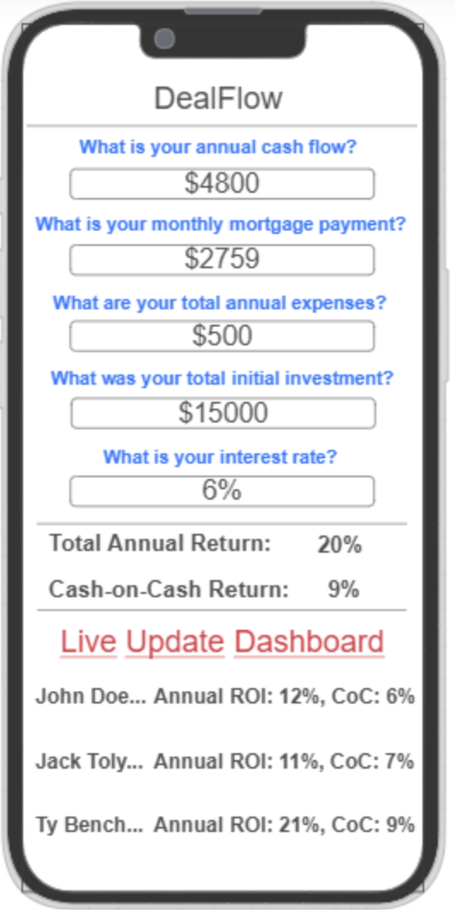

# DealFlow

[My Notes](notes.md)

This is an application is a comprehensive calculator built for real estate investors investing in long-term properties. It will take in several input factors such as monthly/yearly rental income, mortgage term, expenses related to the property, interest rates, down payment, and potentially other inputs. The application, based on the inputs, will instantly return a list of investment metrics, such as cash on cash return, total return, monthly/yearly cash flow, and other metrics. It will also return the monthly mortgage payment, assuming a standard amortization table. 

Each "scenario" can be saved and/or shared pubicly. Users can share their scenarios publicly and can be seen as live updates. A third party API will pull either the market mortgage interest rate, 10 year treasury yield, or CPI inflation rate and display it on the application. 

## 🚀 Specification Deliverable

> [!NOTE]
>  Fill in this sections as the submission artifact for this deliverable. You can refer to this [example](https://github.com/webprogramming260/startup-example/blob/main/README.md) for inspiration.

For this deliverable I did the following. I checked the box `[x]` and added a description for things I completed.

- [ ] Proper use of Markdown
- [ ] A concise and compelling elevator pitch
- [ ] Description of key features
- [ ] Description of how you will use each technology
- [ ] One or more rough sketches of your application. Images must be embedded in this file using Markdown image references.

### Elevator pitch

Have you ever found yourself taking a significant amount of time to go through real estate investing scenarios to calculate cash flow or other metrics, or felt it to be a huge hassle to write or remember the result of these scenarios, resulting in endless re-calculation? The DealFlow application will allow you to input the relevant information for metrics like cash on cash return, total return, and other metrics to analyze the potential in an investment, or refinance scenario. Users will be able to save these scenarios for on demand referance, or optionally share them publicly with others. This application will allow for less hassle and significant time saved when analyzing real estate return scenarios. 

### Design

Here is a frontend design of the application.

### Key features

- Ability for admin to modify questions
- Display live dashboard
- Scenarios are stored for reference
- Ability to change inputs for each question
- Different pages for login, calculation, and storage of saved scenarios

### Technologies

I am going to use the required technologies in the following ways.

- **HTML** - HTML will be used for the basic structure of the project. The structure will include three pages: a login page, a calculation and live updates page, and a page that contains stored scenarios. It will be used for the scenario input questions, and the results as well. 
- **CSS** - CSS will be used to adjust and design good color schemes, whitespaces, clean layout, and simple animations for showing results. 
- **React** - Will help with the login feature, but most importantly allow for clean transition between old and new data for live updates submitted by other users displayed on the UI. 
- **Service** - The web service will handle users saving or loading real estate scenarios so data is accurate between sessions. It will also assist with fetching market rate data by acting as a middle layer to not expose API keys. 
- **DB/Login** - Database will track users across the application, log them in, handle authentication, as well as store real estate scenarios for each respective user.  
- **WebSocket** - When new deals are shared publicly, websockets will be used to push those scenarios to the live dashboard in real time. This will allow data to be published immediately without needing to refresh the page. 

## 🚀 AWS deliverable

For this deliverable I did the following. I checked the box `[x]` and added a description for things I completed.

- [ ] **Server deployed and accessible with custom domain name** - [My server link](https://yourdomainnamehere.click).

## 🚀 HTML deliverable

For this deliverable I did the following. I checked the box `[x]` and added a description for things I completed.

- [ ] **HTML pages** - I did not complete this part of the deliverable.
- [ ] **Proper HTML element usage** - I did not complete this part of the deliverable.
- [ ] **Links** - I did not complete this part of the deliverable.
- [ ] **Text** - I did not complete this part of the deliverable.
- [ ] **3rd party API placeholder** - I did not complete this part of the deliverable.
- [ ] **Images** - I did not complete this part of the deliverable.
- [ ] **Login placeholder** - I did not complete this part of the deliverable.
- [ ] **DB data placeholder** - I did not complete this part of the deliverable.
- [ ] **WebSocket placeholder** - I did not complete this part of the deliverable.

## 🚀 CSS deliverable

For this deliverable I did the following. I checked the box `[x]` and added a description for things I completed.

- [ ] **Header, footer, and main content body** - I did not complete this part of the deliverable.
- [ ] **Navigation elements** - I did not complete this part of the deliverable.
- [ ] **Responsive to window resizing** - I did not complete this part of the deliverable.
- [ ] **Application elements** - I did not complete this part of the deliverable.
- [ ] **Application text content** - I did not complete this part of the deliverable.
- [ ] **Application images** - I did not complete this part of the deliverable.

## 🚀 React part 1: Routing deliverable

For this deliverable I did the following. I checked the box `[x]` and added a description for things I completed.

- [ ] **Bundled using Vite** - I did not complete this part of the deliverable.
- [ ] **Components** - I did not complete this part of the deliverable.
- [ ] **Router** - I did not complete this part of the deliverable.

## 🚀 React part 2: Reactivity deliverable

For this deliverable I did the following. I checked the box `[x]` and added a description for things I completed.

- [ ] **All functionality implemented or mocked out** - I did not complete this part of the deliverable.
- [ ] **Hooks** - I did not complete this part of the deliverable.

## 🚀 Service deliverable

For this deliverable I did the following. I checked the box `[x]` and added a description for things I completed.

- [ ] **Node.js/Express HTTP service** - I did not complete this part of the deliverable.
- [ ] **Static middleware for frontend** - I did not complete this part of the deliverable.
- [ ] **Calls to third party endpoints** - I did not complete this part of the deliverable.
- [ ] **Backend service endpoints** - I did not complete this part of the deliverable.
- [ ] **Frontend calls service endpoints** - I did not complete this part of the deliverable.
- [ ] **Supports registration, login, logout, and restricted endpoint** - I did not complete this part of the deliverable.

## 🚀 DB deliverable

For this deliverable I did the following. I checked the box `[x]` and added a description for things I completed.

- [ ] **Stores data in MongoDB** - I did not complete this part of the deliverable.
- [ ] **Stores credentials in MongoDB** - I did not complete this part of the deliverable.

## 🚀 WebSocket deliverable

For this deliverable I did the following. I checked the box `[x]` and added a description for things I completed.

- [ ] **Backend listens for WebSocket connection** - I did not complete this part of the deliverable.
- [ ] **Frontend makes WebSocket connection** - I did not complete this part of the deliverable.
- [ ] **Data sent over WebSocket connection** - I did not complete this part of the deliverable.
- [ ] **WebSocket data displayed** - I did not complete this part of the deliverable.
- [ ] **Application is fully functional** - I did not complete this part of the deliverable.
